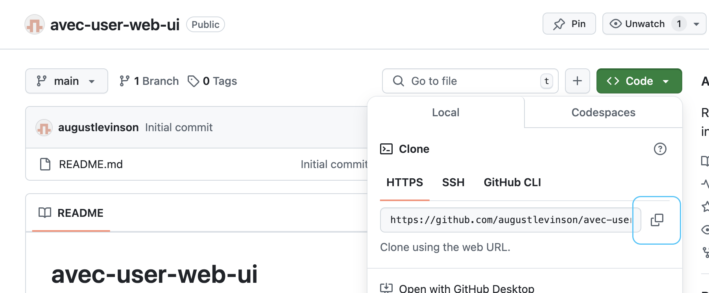
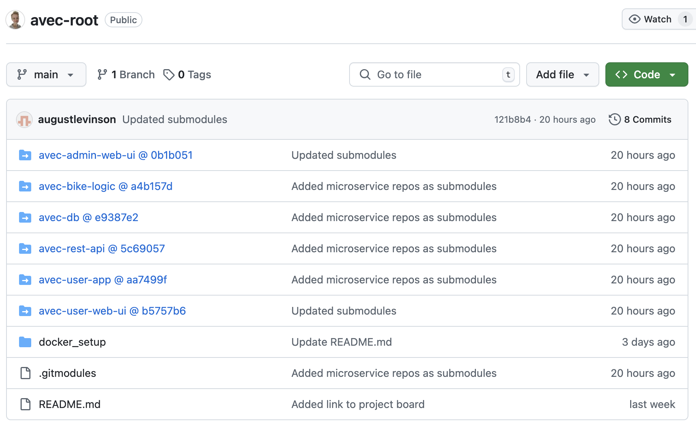
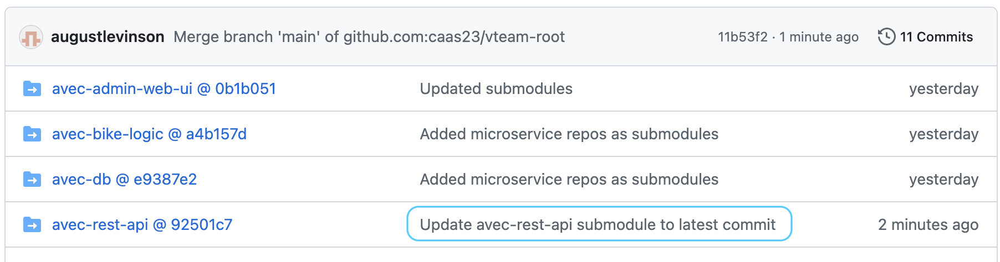
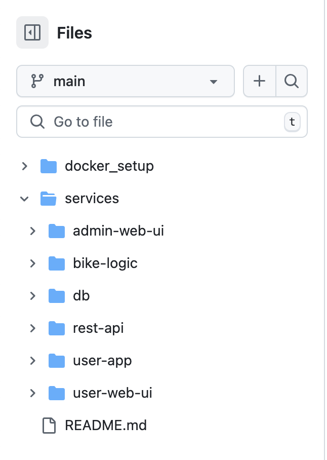

report-submodules-vs-monorepo
===

Choosing how to structure your version management can have a huge impact on the workflow of your team down the line. This report explores two common approaches: gathering all services in a single monorepo vs. using multiple GitHub repositories as submodules in a parent repository, including basic setup instructions. My examples are based on a scooter rental project with six microservices: *admin-web-ui*, *bike-logic*, *db*, *rest-api*, *user-app*, and *user-web-ui*.

Contents
---
[Prerequisites](#prerequisites)
[Submodules setup](#submodules-setup)
[Monorepo setup](#monorepo-setup)
[Comparison](#comparison)
[Conclusion](#conclusion)

Prerequisites
---
A terminal that supports [git](https://git-scm.com/) and a [GitHub](https://github.com/) account.

Submodules setup
---
Git submodules are repositories within repositories or, more accurately, pointers to other repositories within a repository. They allow you to include other repositories in your project, which can be useful for managing dependencies or splitting a project into smaller parts.

### 1. Create a parent repository

Create a repository to import the other repositories from. If you are unsure of how, follow [this guide](https://docs.github.com/en/repositories/creating-and-managing-repositories/quickstart-for-repositories).

Clone the repository as described in [this guide](https://docs.github.com/en/repositories/creating-and-managing-repositories/cloning-a-repository).
___
### 2. Create separate repositories for each microservice

Create a repository each for every microservice. I choose to prepend all repo names with *avec*, which is the name of the project (e.g. *avec-admin-web-ui*, *avec-bike-logic* and *avec-db*).

___
### 3. Add the submodules to the parent repository

The URL to add can be found in the Local > HTTPS tab of the Code section of your submodule-to-be:



Navigate to your parent repository:

```
cd path/to/parent-repo
```

Add the other repositories as submodules using their URLs:
```
git submodule add https://github.com/augustlevinson/avec-admin-web-ui.git
git submodule add https://github.com/augustlevinson/avec-bike-logic.git
git submodule add https://github.com/augustlevinson/avec-db.git
git submodule add https://github.com/augustlevinson/avec-rest-api.git
git submodule add https://github.com/augustlevinson/avec-user-app.git
git submodule add https://github.com/augustlevinson/avec-user-web-ui.git
```
___
### 4. Initialize and update submodules

After cloning the parent repository, initialize and update all submodules:

```
git submodule update --init --recursive
```

Push the changes to the parent repository:

```
git add .
git commit -m "Added microservice repos as submodules"
git push
```

Navigating to the parent repository in GitHub, you can now see the submodules listed as directories:


*The submodules are snapshots of the specific branch at the time of adding them. To update them to the latest version, you first need to have their repos updated and then push those changes to the parent repo.*

Update all submodules to their latest commit on the tracked branch (usually main):
```
git submodule update --remote
```

Commit the changes in the parent repository to record the updated commits of each submodule:
```
git add .
git commit -m "Update avec-rest-api submodule to latest commit"
git push
```


*Now you should see the updated submodule in your parent repository.*

This is just a basic guide to get going. For a more extensive guide on the git submodule tool, consult the [official git documentation](https://git-scm.com/book/en/v2/Git-Tools-Submodules).

Monorepo setup
---
A monorepo is a single repository that contains all the code for a project. To separate the code into different parts, you can use directories or packages.

### 1. Create a repository
Create a repository in GitHub and clone it to your origin - the same way you did for the [parent repository](#1-create-a-parent-repository) in the submodule method.
___

### 2. Create a services directory containing subdirectories for each microservice

```
mkdir services
cd services

mkdir admin-web-ui
mkdir bike-logic
mkdir db
mkdir rest-api
mkdir user-app
mkdir user-web-ui
```

Navigate to the root of your repository and add the services directory:

```
git add .
git commit -m "Changed from submodules to monorepo structure"
git push
```


*Each microservice has its own subdirectory.*


Comparison
---
### Submodules
#### Pros
- **Independent repositories:** Clean separation of concerns, as each team or developer works on specific repositories. Each microservice is isolated and can have its own lifecycle.
- **Explicit dependencies:** Dependencies are clearly tied to the submodule versions.

#### Cons
- **Complex workflow:** Updating submodule references requires frequent manual intervention (git submodule update, git add an so on).
- **Hard for new contributors:** New contributors must understand submodules and how they interact with the main repo, adding a learning curve.

### Monorepo
#### Pros
- **Simpler version control:** All changes are tracked in one place, making cross-service changes easier.
- **Easier to manage shared utilities:** Utilities and libraries can be included at the root level and used by all services.

#### Cons
- **Repository size:** The repository can grow large over time, making it slower to clone and harder to manage.
- **Permission handling:** Granular access control isn’t possible unless combined with tools like GitHub’s CODEOWNERS to limit who can work on specific directories.

Conclusion
---
While submodules has great potential when it comes to modularity, they can be tricky to work with. The monorepo approach is simpler and more straightforward, but it can become more complicated as the project grows. The best choice depends on the size and complexity of your project and the way your team prefers to work.

___
*August Levinson*
